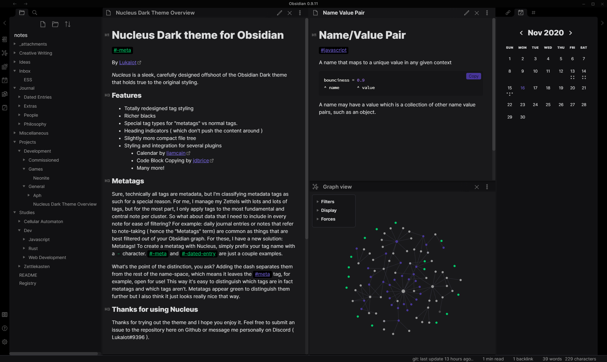
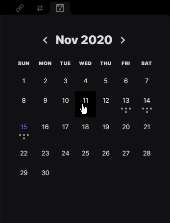
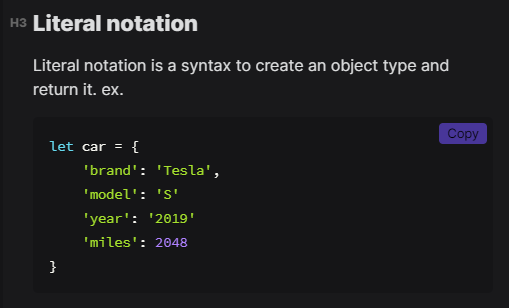
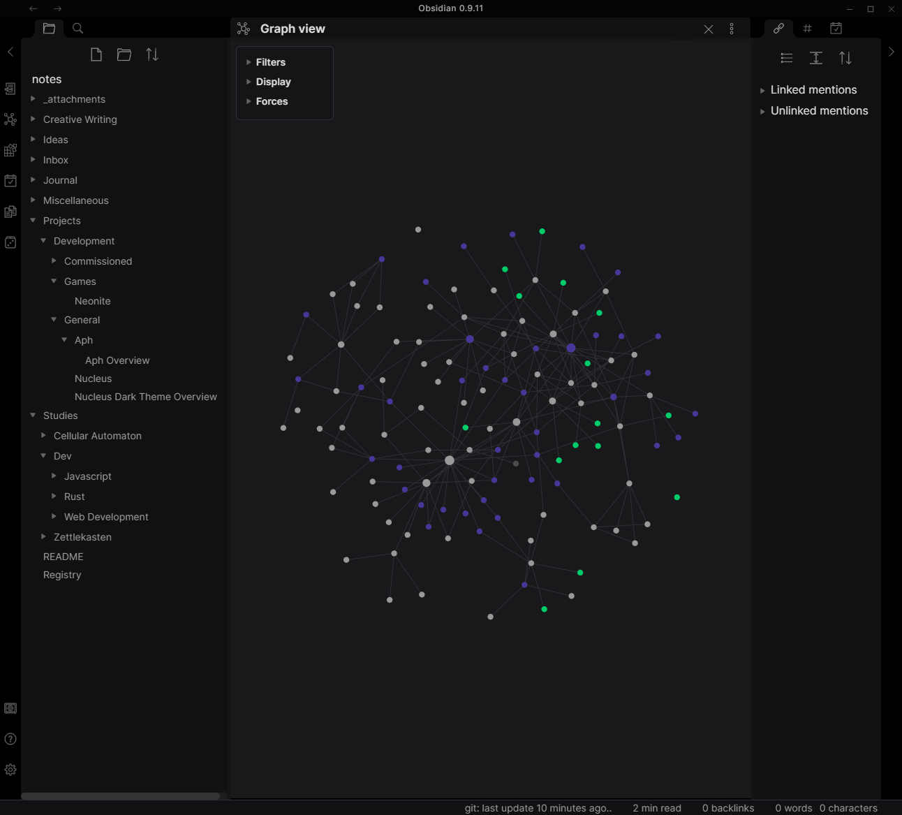

# Nucleus dark theme for Obsidian

By [Lukalot](https://github.com/Lukalot)

_Nucleus_ is a sleek, carefully designed offshoot of the Obsidian Dark theme that holds true to the original styling.

### Features
- Totally redesigned tag styling
- Richer blacks
- Special tag types for "metatags" vs normal tags.
- Heading indicators ( which don't push the content around )
- Slightly more compact file tree
- Styling and integration for several plugins
	- Calendar by [liamcain](https://github.com/liamcain/)
	- Code Block Copying by [jdbrice](https://github.com/jdbrice)
	- Many more!

 

### Metatags
[edited]
Sure, technically all tags are metadata, but I'm classifying metadata tags as such for a special reason. For me, I manage my Zettels with lots and lots of tags, but usually, when I apply a tag, it clarifies the subject matter of the note. So what about the *type* of the note? For example: A daily journal entry or a note that refers to the process of note-taking ( hence the "Metatags" term) are common as things that are best filtered *out* of your Obsidian graph, and they are *types* of note as opposed to simply subjects. For these, I have a new solution: Metatags! To create a metatag with Nucleus, simply prefix your tag name with a `-` character. #-meta, #-project and #-dated-entry are just a couple examples.

What's the point of the distinction, you ask? Adding the dash separates them from the rest of the name-space, which means it leaves the #meta tag, for example, open for use! This way it's easy to distinguish which tags are in fact metatags referring to the note type, and which tags aren't. Metatags appear green to distinguish them further, and I also think it just looks really nice that way.

### Use
To install Nucleus:
 - Download the latest release
 - Drop the `obsidian.css` file into your vault directory (save a backup of your current theme if necessary)
 - Make sure that custom CSS is enabled in your appearance settings.

### Thanks for using Nucleus theme
Thanks for trying out Nucleus, I hope you enjoy it! Feel free to submit an issue to the repository here on Github or message me personally on Discord ( Lukalot#9396 ).
